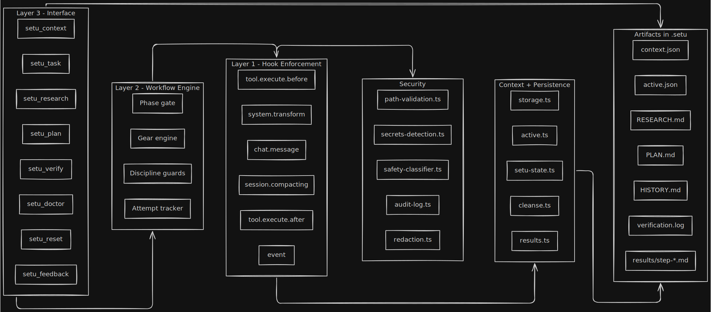

# Setu OpenCode

> **Pre-emptive discipline for AI coding in OpenCode.**
> **Think first. Verify always. Ship with evidence.**
> Other tools fix mistakes after they happen. Setu prevents them before they start.

Setu bridges the gap between "AI that codes fast" and "AI that codes correctly."

[](https://deepwiki.com/pkgprateek/setu-opencode)
[](https://www.npmjs.com/package/setu-opencode)
[](LICENSE)
[](https://opencode.ai)

**Setu** (Sanskrit: सेतु, "bridge") is a discipline layer that helps agents read before they write.

---

## Why I Built This

I was building a product. Twice, my AI agent — one of the best available — deleted 12+ hours of my work. Not maliciously. It just *forgot*. It forgot I told it not to touch certain files. It forgot the architecture we discussed. It forgot why we made specific decisions three prompts ago.

And when I ran my dev server, it ran `npm run build` anyway — overwriting my bundles, breaking my local environment.

Every new session: "Let me explain the codebase again..."  
Every compaction: "No, we already tried that approach..."  
Every build command: "Please check if the dev server is running first..."

I was spending more time re-explaining than coding. Burning tokens on ghost loops — the same broken approach, 15 retries, zero progress.

**So I built the discipline layer I needed.** Setu bridges the gap between "AI that codes fast" and "AI that codes correctly."

---

## Why Other "Solutions" Don't Work

**Prompt engineering?** "Please think step by step" — ignored when the model is in flow state.

**AGENTS.md?** Great until the agent "forgets" your rules mid-session.

**Better models?** They will still hallucinate, still forget context, still rush to implementation.

**The truth:** You can't solve this with better prompts. You need **structure**.

---

## Setu: Structure That Actually Works

Setu doesn't ask your agent to "be more careful." It creates a workflow where carefulness is the default.



---
Need the full architecture set? See [docs/DIAGRAMS.md](./docs/DIAGRAMS.md).

## How It Works (No Willpower Required)

Setu hydrates each session — gathering context and understanding your codebase before any gears engage. Your agent then automatically progresses through three phases. Can't skip. Can't rush.

**🔍 Scout: Understand First, Build Never**

Agent can read. Can explore. Can analyze. **Cannot write a single line of code.**

- Reads your codebase thoroughly
- Analyzes patterns and architecture  
- Documents findings in `.setu/RESEARCH.md`

*Result: Solid foundation before any code is written.*

**📐 Architect: Design the Approach**

Agent creates PLAN.md with implementation steps. **Still cannot touch your source code.**

- Creates detailed implementation steps
- Designs the approach
- Documents in `.setu/PLAN.md`

*You review. You approve. Only then does it proceed.*

**🔨 Builder: Execute With Confidence**

Now (and only now) does it implement. Verification runs at the end, and you can run `setu_verify` after major steps.

- Implements the approved approach
- Runs verification before completion
- Ships only when everything passes

*Build fails? Won't claim "done." Tests fail? Won't claim "done."*

**The gears shift automatically.** Your agent can't accidentally skip ahead. The workflow ensures every phase gets the attention it deserves.

---

## What Makes This Different

### The "Eager Junior Dev" Problem

**Without Setu:**
```text
You: Add auth
Agent: *immediately starts coding*
Agent: Done!
You: This is completely wrong
Agent: Sorry, let me fix it
Agent: *tries the same broken approach*
```

**With Setu:**
```text
You: Add auth
Agent: I'm in Scout phase. Let me understand your auth patterns first...
[Reads your existing auth code]
[Analyzes your middleware structure]
[Documents findings in RESEARCH.md]

Agent: Moving to Architect phase. Here's my plan:
[PLAN.md with step-by-step approach]
[Specifically addresses your existing patterns]

You: Looks good, proceed
Agent: Executing plan with verification...
[Build passes]
[Tests pass]
Done.
```

### The "Context Goldfish" Problem

**Without Setu:**  
Every session starts with "Let me explore the codebase..." (even though you did this yesterday)

**With Setu:**  
RESEARCH.md and PLAN.md persist across restarts. Your agent picks up exactly where you left off. No re-explaining. No déjà vu.

### Safety Mechanisms

Three independent layers protect your codebase:

| Layer | Purpose | How It Helps |
|-------|---------|--------------|
| **Hydration Gate** | Prevents action before understanding | Agent explores safely first; write paths unlock only after understanding is established |
| **Confirmation Flow** | Double-checks risky operations | Production deployments, destructive commands prompt for explicit approval |
| **Read-Before-Write** | Prevents accidental overwrites | Agent must read existing files before editing them |

These aren't roadblocks—they're guardrails that keep your agent on the right path.

---

## Installation (30 Seconds)

Current stable path:

```json
// opencode.json
{
  "plugin": ["setu-opencode"]
}
```

Restart OpenCode. Press **Tab** until you see "Setu." Done.

**Note:** First run requires one restart. Setu appears in Tab cycle on second launch.

Planned install UX (upcoming):

- `npx setu-opencode@latest init`
- `npm install -g setu-opencode && setu-opencode init`

These commands are planned to automate OpenCode config edits safely. Until then, use `opencode.json` setup above.

### 30-Second Proof (Run This)

```text
You: Update auth middleware to support JWT rotation
Agent: [Scout gear] I need to read existing auth files first.
Agent tries edit first -> blocked

Agent: [Reads src/auth/* and related middleware]
Agent: setu_research(...) -> writes .setu/RESEARCH.md
Agent: setu_plan(...) -> writes .setu/PLAN.md

You: approve
Agent: implements changes
Agent: setu_verify(...) -> build/test/lint evidence
```

If this flow is not enforced, Setu is not configured correctly.

---

## Four Breakthroughs

### 1) Gearbox Workflow (Automatic Discipline)

Setu shifts through Scout -> Architect -> Builder based on artifacts, not vibes.

- Scout: research only, no source writes
- Architect: plan only, no source writes
- Builder: implement with verification before completion

### 2) Hook Enforcement (Physics, Not Suggestions)

Setu enforces behavior at the tool layer. It does not rely on prompt obedience.

- `tool.execute.before` blocks unsafe or out-of-phase actions
- `tool.execute.after` records verification and progress evidence
- `system.transform` injects gear-aware guidance each turn

### 3) Persistent Artifacts (No Re-Explaining)

Setu persists task context into project artifacts so sessions can resume with continuity.

- `.setu/RESEARCH.md` captures discovered truth
- `.setu/PLAN.md` captures approved intent
- `.setu/HISTORY.md` archives prior task artifacts

### 4) Verification Gate (No Blind "Done")

Completion is coupled to evidence, not confidence.

- `setu_verify` validates build/test/lint before claiming completion
- risky operations require explicit confirmation
- read-before-write protection reduces accidental file damage

---

## Why This Isn't Just Another Workflow Tool

**Other approaches:** "Please follow this workflow" (ignored)

**Setu:** Uses OpenCode hooks to enforce the workflow at the system level:
- `tool.execute.before` — Guides what can be done when
- `tool.execute.after` — Tracks progress and verification  
- `experimental.session.compacting` — Preserves context across memory limits

**Translation:** Your agent literally cannot skip steps. Not because it's being "good," but because the system won't let it.

### Comparison

| Feature | Setu | Other Approaches |
|---------|------|------------------|
| **Enforcement** | ✅ Hook-level (structural) | ❌ Prompt-based (optional) |
| **Setup** | One line | Complex configuration |
| **Workflow** | Automatic gears | Manual mode switching |
| **Complexity** | 🟢 Low friction | 🔴 High overhead |

---

## Real Results

| Before Setu | After Setu |
|-------------|------------|
| "Done!" → broken build | "Done!" → actually works |
| Re-explaining codebase every session | Context persists across restarts |
| Same wrong approach, 15 retries | Attempt tracking with intelligent pivots |
| "Oops I ran npm publish" | Production commands require explicit approval |
| Agent forgets after compaction | Context survives memory limits |

---

## Tools Included

| Tool | What It Does |
|------|--------------|
| `setu_context` | Explicit alignment checkpoint (fallback when clarification/tooling needs it) |
| `setu_research` | Document findings (Scout phase) |
| `setu_plan` | Create implementation plan (Architect phase) |
| `setu_verify` | Run build/test/lint (Builder phase) |
| `setu_doctor` | Check environment before executing |
| `setu_task` | Create tasks with constraints |
| `setu_feedback` | Help improve Setu |

---

## Skills Included

| Skill | Purpose |
|-------|---------|
| `setu-bootstrap` | Project setup following the discipline protocol |
| `setu-verification` | Verification and release checks |
| `setu-rules-creation` | Create effective AGENTS.md files |

Skills load on-demand, not at startup.

---

## What's Next

**v1.3** — Parallel orchestration engine with flexible task model  
**v2.0** — DAG Swarm: Parallel execution with goal verification  
**v3.0** — Setu Claude Code + MCP integration for multi-platform support  

See [ROADMAP.md](./ROADMAP.md) for full details.

---

## When NOT to Use Setu

- **Rapid prototyping** where you want maximum speed — use Build mode (Tab)
- **Learning/exploration** — use Plan mode (Tab)  
- **Already have a workflow that works** — Setu enhances, doesn't replace

**Setu is optional discipline, not mandatory bureaucracy.**

---

## Technical Details

- Skills load on-demand rather than front-loading context.
- Version is tracked by the npm badge at the top of this README.

**See:** [ROADMAP.md](./ROADMAP.md) for upcoming features
**See:** [docs/DIAGRAMS.md](./docs/DIAGRAMS.md) for all architecture diagrams

---

## License

Apache 2.0 — See [LICENSE](./LICENSE)

---

**Setu:** *Because "move fast and break things" is fun until you're debugging at 2 AM.*
