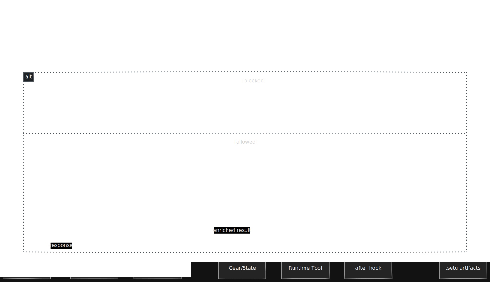
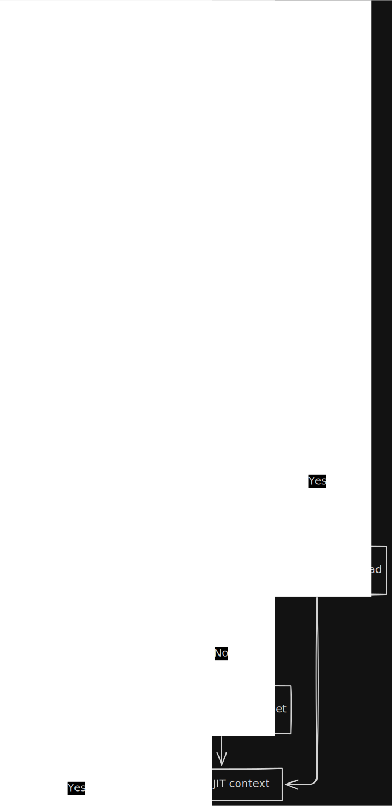
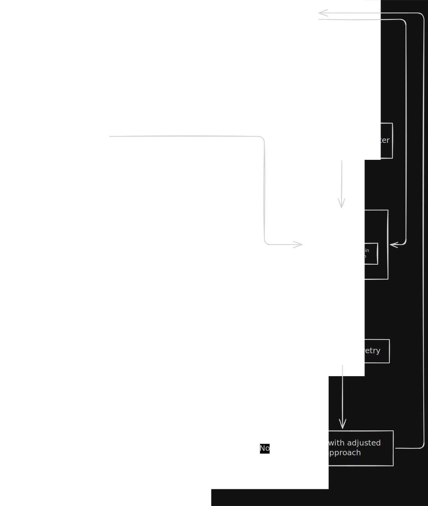

# Setu Diagrams

This file contains the public diagram set defined in `docs/internal/DIAGRAMS.md`.

## Diagram 1: Session Flow

---

## Diagram 2: Component Architecture

---

## Diagram 3: Sequence Diagram

---

## Diagram 4: Gear State Machine

---

## Diagram 5: JIT Context Cleanse

---

## Diagram 6: Ghost Loop Prevention

